# 使い方

## 読み込み

XMLで記述された画像データを読み込みます。

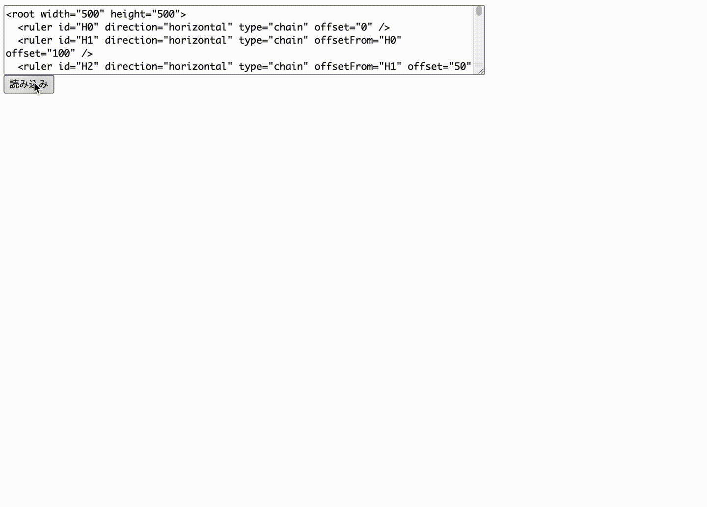

## ルーラー移動

ルーラーはドラッグで移動できます。依存関係があるルーラーも同時に動きます。ルーラーの移動に合わせて図形も移動します。

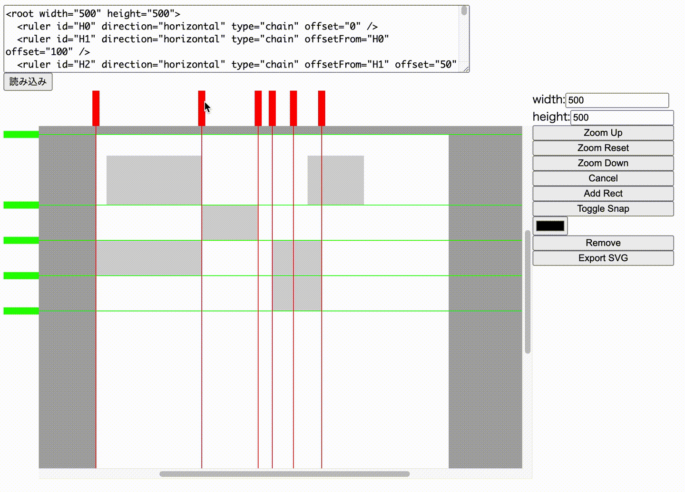

## 図形挿入

現在実装している図形は長方形のみです。長方形は2点を選択して挿入します。

ルーラーの交点にスナップして、交点に依存する図形を挿入できます。ルーラーの移動に合わせて図形も移動します。

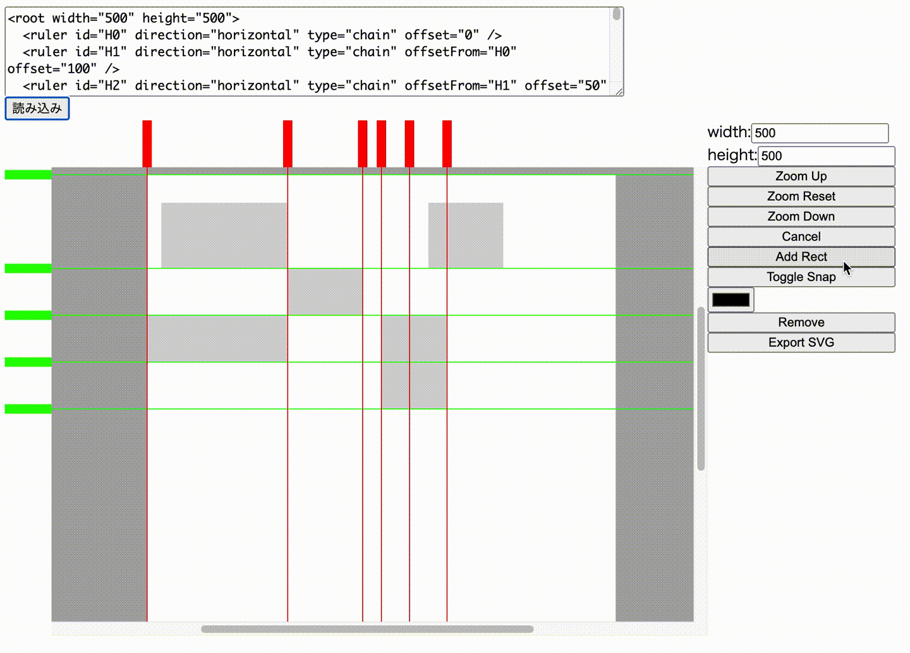

Toggle Snap ボタンを押すことで、交点スナップと絶対位置選択を切り替えることができます。絶対位置を指定して挿入した図形はルーラーの移動に影響されません。

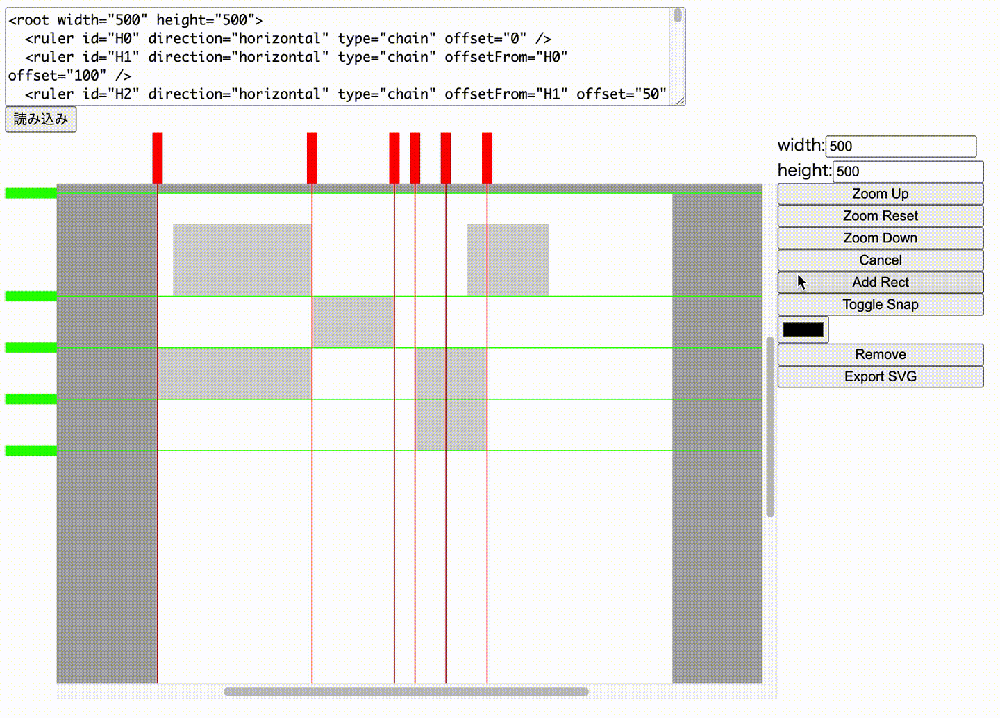

一方を交点スナップで、もう一方を絶対位置で指定することもできます。この場合、交点スナップで選択した点だけが、ルーラーの移動に合わせて移動します。絶対位置で指定した点を追い越すこともできます。

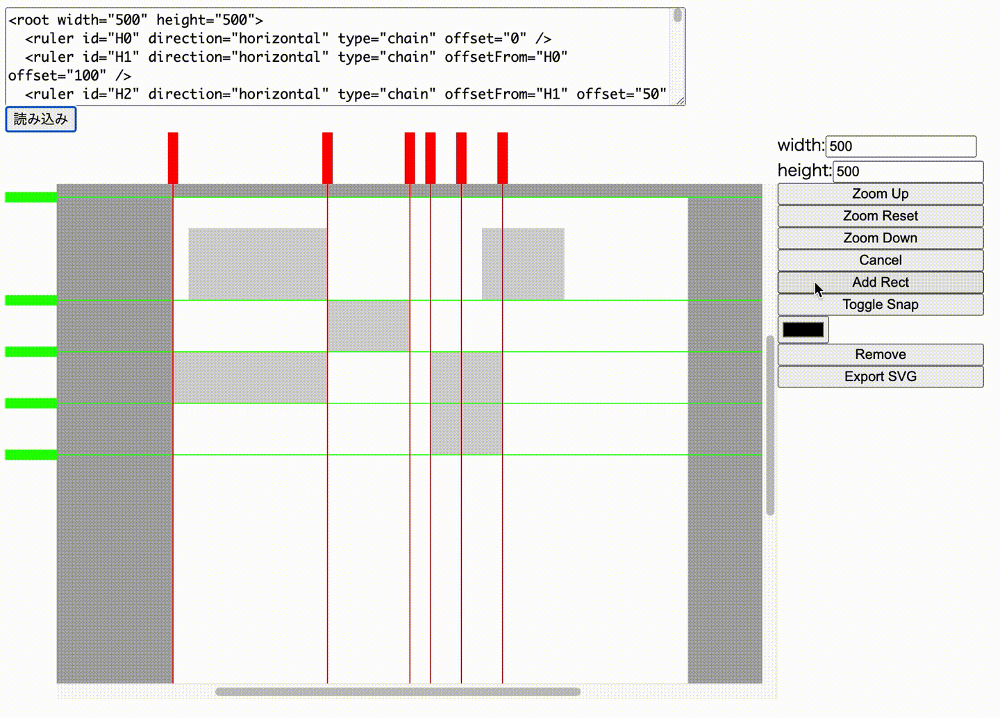

## 図形の選択・削除

図形はクリックして選択できます。別の図形をクリックすると選択中の図形が解除され、クリックした図形が選択されます。選択中の図形を削除できます。

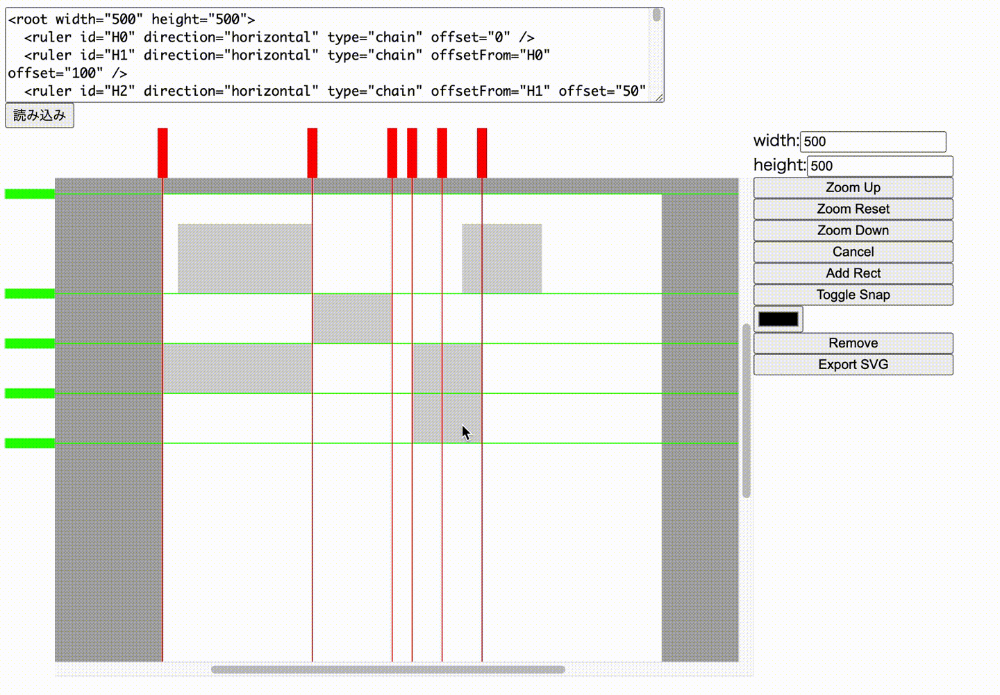

## 図形のスタイル

選択した図形の塗りつぶし色を変更できます。

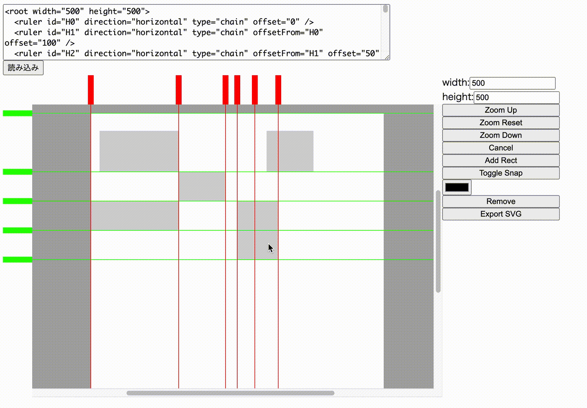

## 画像の出力

`out.svg`というファイル名でSVG形式でダウンロードできます。

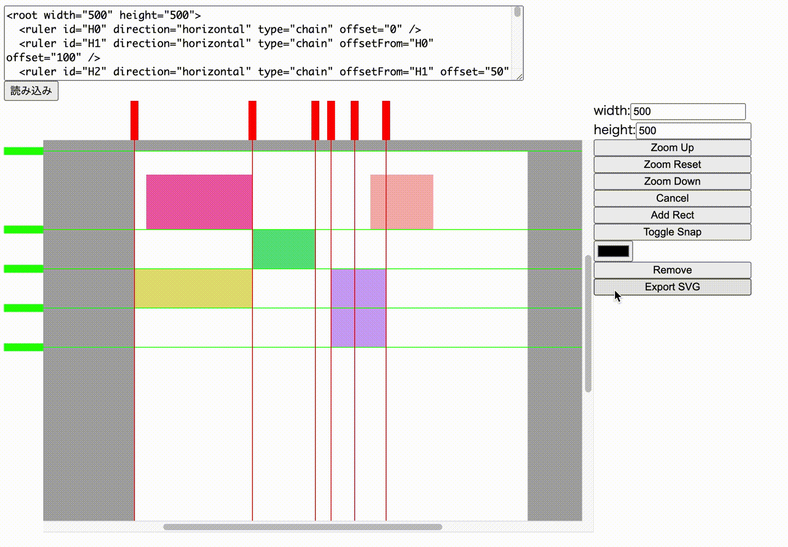

## ズーム

ズームイン・ズームアウトができます。視点の調整は現状未実装です。

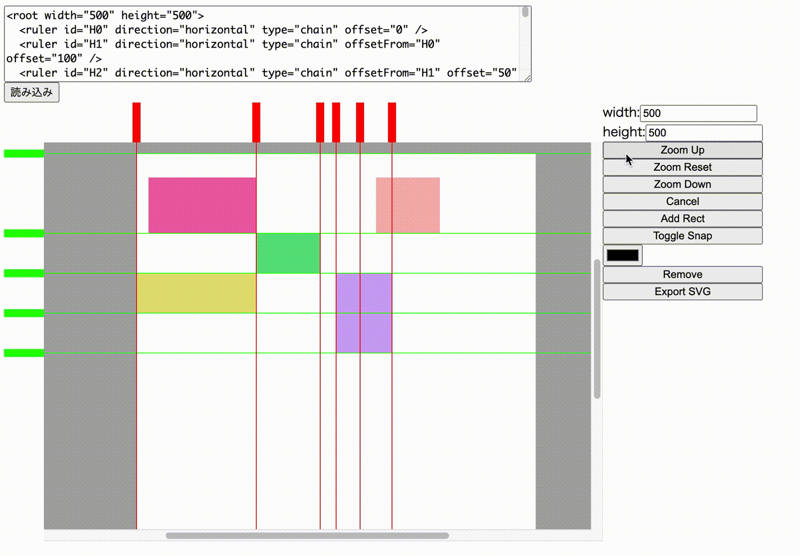

## 画像サイズ変更

画面で白く見えている範囲が出力されるSVGの画像範囲です。widthとheightを変更できます。

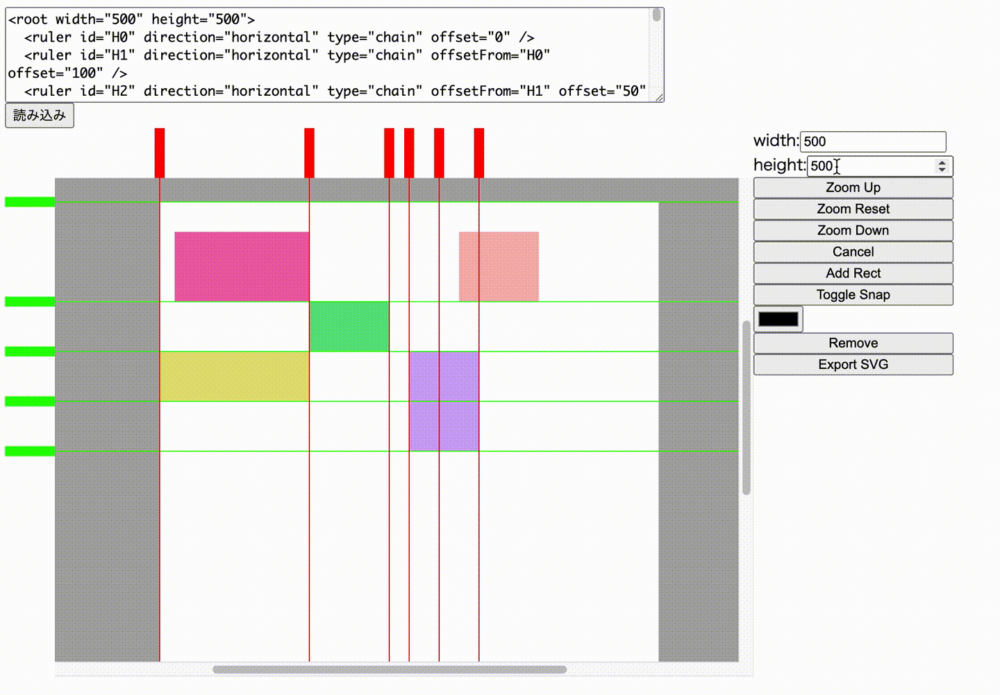

## 画像定義XMLの編集

画像定義XMLを直接編集することもできます。
インタラクティブ操作のXMLへの反映は現在未実装です。

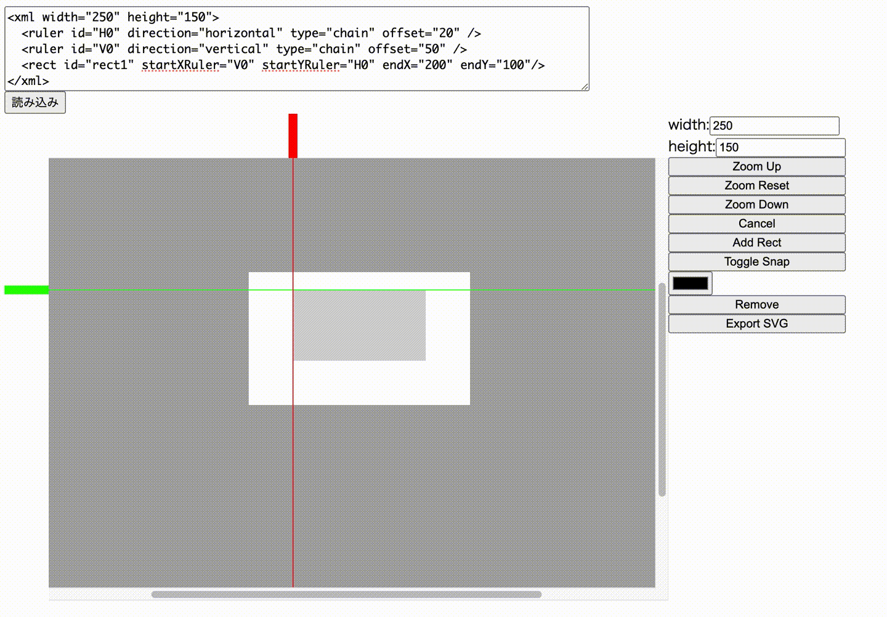

